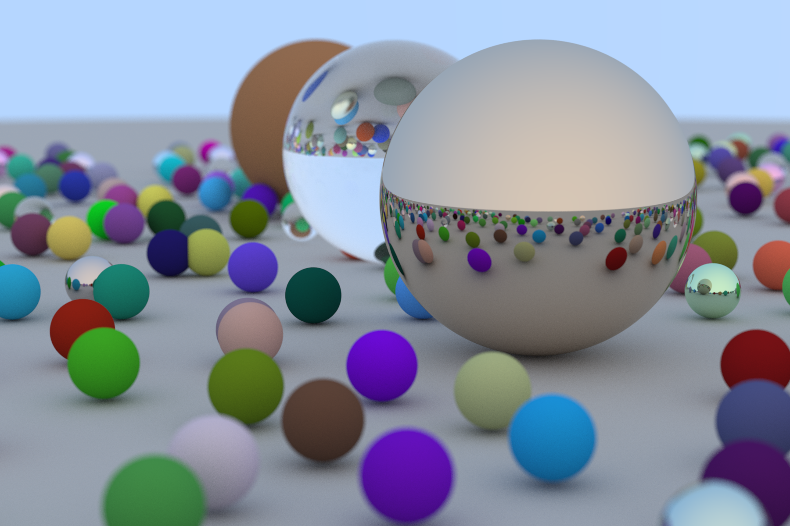

# Simple ray tracer written in Rust following [_Ray Tracing in One Weekend_](https://raytracing.github.io/books/RayTracingInOneWeekend.html).

## Final render

## Implementation details

- `vec3.rs`:
  - implements `Vec3`, which represents both positions and offsets in space, along with helper functions such as
    `normalize`, `interpolate`, `reflect`, `refract`, and `random_in_unit_sphere`;
  - aliases `Vec3` as `Color`, which represents color vectors with components between 0 and 1; and
  - implements `Ray`, which represents rays in space.
- `hittable.rs`:
  - implements `HitRecord`, which represents information about a `Ray`-`Hittable` intersection such as point of
    intersection, unit normal, and intersection material;
  - introduces `Hittable`, which describes objects that can be hit and produce `HitRecord`'s;
  - implements `HittableList`, which `impl Hittable` and represents collections of `Hittable`'s; and
  - implements `Sphere`, which `impl Hittable` and represents spheres in space.
- `material.rs`:
  - introduces `Material`, which describes materials that potentially generate `Color`'s and redirect `Ray`'s from a
    `Ray`-`Hittable` intersection;
  - implements `Lambertian`, which `impl Material` and represents matte surfaces that reflect and redirect `Ray`'s
    randomly and thus appear "fuzzy";
  - implements `Metal`, which `impl Material` and represents metallic surfaces that reflect `Ray`'s and appear "shiny";
    and
  - implements `Dielectric`, which `impl Material` and represents transparent surfaces that refracts `Ray`'s and appear
    "clear".
- `camera.rs` implements `Camera`, which represents cameras in space with different positions, angles, fields of view,
  aspect ratios, apertures, and focus distances, and can produce `Ray`'s for positions in the frame.
- `main.rs`:
  - implements `ray_color`, which queries the result colors from `Ray`'s intersecting with `Hittable`'s;
  - implements `write_color`, which applies gamma correction to `Color`'s and writes their RGB values;
  - implements `random_world`, which generates random scenes as `HittableList`'s; and
  - sets up and renders a random scene, which is displayed above.

## Notes

- To render a scene, use `cargo run --release > dump.ppm`.
- Previous incremental renders can be found in `renders` in both `ppm` and `png` format, labeled by the relevant
  sections in [_Ray Tracing in One Weekend_](https://raytracing.github.io/books/RayTracingInOneWeekend.html).